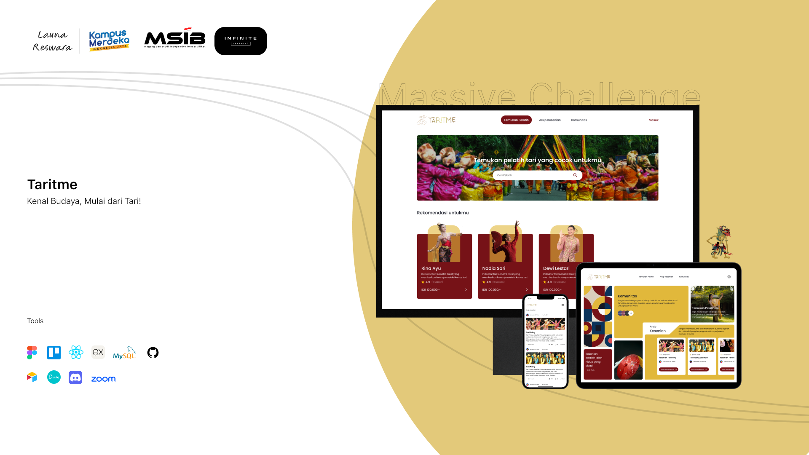

  <h1>Taritme</h1>
  
Kenali Budaya, Mulai dari Tari!

## About

Our website is based on an online platform that is presented as an innovative solution by making it easier for users to learn more about Indonesian culture, especially finding professional dance trainers, providing informative articles about traditional dance, and offering a community platform for traditional dance lovers to share experiences and make friends. Users can learn to explore traditional dances more easily, help preserve culture, and build a strong community network. Taritme is a complete solution for learning to understand and preserve traditional dance.

## Features

- Temukan Pelatih
- Arsip Kesenian
- Komunitas

## Screenshots

|                                                                      |                                                                      |
| :------------------------------------------------------------------: | :------------------------------------------------------------------: |
|  |  |
|  |  |
|  |  |
|  |  |
|  |  |
|  |  |
|  |  |
|  |  |
|  |  |
|  |  |
|  |

## Tech Stack

- React JS
- Typescript
- Tailwind CSS + shadcn/ui
- Framer Motion
- React Query
- Redux Toolkit
- Contentful
- Mailerlite
- Cypress

## Getting Started

### A. Prerequisites

- Node.js (Latest Version).
- Docker.

### B. Process

- Make sure that you've already setup the backend side. 
- Clone this repo.
- Go to the project folder, and type `npm install` to install all needed dependencies. 
- Create a `.env` file. You can check the format in `.env.example` file.
- After that, type `npm run dev` to run this project. See the result in the Browser => http://localhost:3000.
- If you want to build this project in Docker Container, just type `docker compose up --build` in your terminal and see the result.

## Note

- This project are deployed in a VPS with Ubuntu 22.04 as the operating system, using Nginx as a Web Server, PM2 to run and automate Backend workflow, and Cloudflare for subdomain.
- We use conventional commits as commit style and rules. If you want to know more about it, [read here](https://www.conventionalcommits.org/en/v1.0.0/).
- For isolated build/deployment/testing, we use Docker. If you want to know more about it, [read here](https://www.docker.com/).
- This project are using Typescript as the main programming language for Frontend side. If you want to know more about it, [read here](https://www.typescriptlang.org/).
- For E2E (End to End) Testing, this project are using Cypress. If you want to know more about it, [read the documentation](https://docs.cypress.io/guides/overview/why-cypress).
